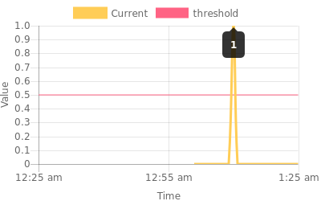

# lambda-graph
Microservice that will run in lambda. 
It receives a JSON with information about the changes of a property over time. 
It creates a multiline graph, and then creates a PNG of that graph, and send it to S3 so it can embed on a Slack notification 

## AWS Lambda
In order to upload the function to Lambda, I did some changes in the server.js (No need for express.js, this is now Lambda role).
So I created a folder called lambda, and there the server.js is modified, and there is some .so files,
because I use Canvas module. It requires some C binaries. 

##  Chart example

